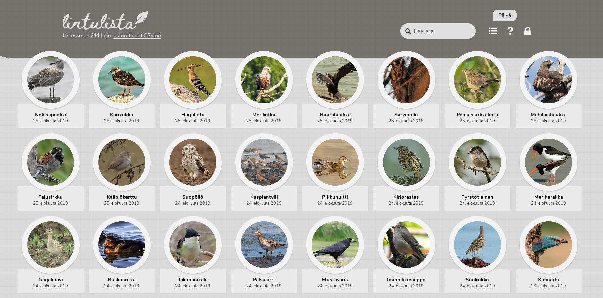

# Lintulista
Lintulista is a Finnish-language web app for hobbyist birdwatchers to keep track of their sightings.

With an easy-to-use interface and emphasis on visual presentation, Lintulista offers an interesting and accessible way to record your sightings - a good alternative to plain Excel tables.

You can find Lintulista live on the web [here](https://www.tarpeeksihyvaesoft.com/lintulista/). Note that the app is currently in beta, so you may still encounter issues that will be absent in more mature versions.

**Features**
- Easy and convenient to use - no account creation or login required
- Visually compelling - sightings are displayed as images rather than as plain text
- Share your sightings with others via a URL
- Integrates BirdLife Finland's 100 Lajia challenge



# Usage
This section describes how to put Lintulista into use, either as an end-user or a developer.

For instance, you'll find instructions on how to set up and deploy Lintulista on a server.

## End-user
You can find Lintulista's end-user documentation in the [guide/](guide/) directory; noting that it is written in Finnish.

## Developer

### Introduction to the codebase
Lintulista's codebase exhibits a three-way split:
- Client
- Server
- Tests

The client-side code, which you can find under [client/](client/), is written in JavaScript, and uses the [React](https://reactjs.org/) library (version 16.8.6; although version 16.9 may be adopted in the near future) for UI functionality. The client provides the user a graphical view to Lintulista's backend, as well as means to modify certain data in the backend. (Technically, the files [index.html](index.html) and [view.php](view.php) are also part of the client, as they serve as points of entry for the user's browser.)

The server-side code, which you can find under [server/](client/), is written in PHP (up to version 7.0), and provides the client an API for interacting with the backend (e.g. the database).

Additionally, implements for rudimentary automated testing are provided under [tests/](tests/).

#### Non-code assets
The repo also includes several non-code assets - most typically, image files. Perhaps the most notable of these assets is the collection of bird thumbnails under [server/assets/images/bird-thumbnails/](server/assets/images/bird-thumbnails/), which are hosted server-side and used by the client for decorating its view.

Non-code assets are normally found under an `assets/` directory, e.g. [server/assets/](server/assets/) and [client/assets/](client/assets/).

### Important concepts
Before moving on to the rest of the sections, you may find it useful to briefly review the following core concepts and terminology underlying Lintulista.

Lintulista offers the user a means to 'write down' their sightings of various bird species. As such, the client-side view operates on `lists` of these `observations`; each observation naming a particular species of bird and the date on which it was sighted. The user is free to choose how to organize their observations into lists - they may only ever use one list, for instance, or employ lists for thematic organization (e.g. a separate list for each year's observations). Consequently, the user's expected workflow in Lintulista is: `create list x`, `add/remove/modify observations in list x`.

For reasons that will be explained in more detail later down, lists are not strictly user-specific (e.g. associated with a user account). Instead, once a user has created a list, anyone may access that list, provided that they have the list's `key` - a string that uniquely identifies the list. Each list has two keys: one for public access - with which the list is accessed in read-only mode - and one for private access - which grants its holder both read and write access to the list. These keys are known as `view key` and `edit key`, respectively. In using Lintulista, the list's key is passed along as a URL parameter, hence both the view key and the edit key are potentially publically visible any time one uses them.

A different way to phrase the above is that there are no user accounts or passwords in Lintulista. Lists can be created, accessed, and modified potentially by anyone; although in many cases, write access is inhibited unless one has the edit key.

### Setting up Lintulista
This section describes how to build, configure, and deploy Lintulista from scratch. The process does involve a few steps, but is fairly straightforward overall.

Setting up Lintulista involves the following steps:
- building the code
- preparing the database
- configuring the .htaccess file
- deploying the code and assets onto a server

#### Building
Lintulista depends on [Babel](https://babeljs.io/) for JSX and minification. You can install the required dependencies by executing the following in the repo's root:
```
$ npm install @babel/core @babel/cli @babel/preset-react babel-preset-minify
```

Once you have Babel installed as per above, you can build Lintulista with
```
$ cd build
$ ./build-dev.sh
```

substituting `build-dev.sh` with `build-release.sh` for release builds. The compiled files will be placed in the [client/dist/](client/dist/) directory, from which [index.html](index.html) and [view.php](view.php) will pick them up as appropriate.

#### Database
Lintulista uses a MySQL database for storing user-generated data. The data span four tables, in total.

##### Access credentials
You can to provide the credentials for accessing the database in `lintulista-sql.json`, which should have the following contents:
```
{
    "host": "...",
    "user": "...",
    "password": "...",
    "database": "...",
    "pepper": "..."
}
```

The first four properties correspond to the parameters to PHP's `mysqli_connect()` function. The last property, `pepper` is a string used by Lintulista to pepper certain hashes - you can use e.g. a randomly-generated string of some length, dependent on your strategy of hashing.

You can set the path in which Lintulista looks for this file via the constructor to the DatabaseAccess class in [server/database.php](server/database.php).

##### Tables
The database's data are laid out in four tables, as described below.

**Table 1: lintulista_lists**. Stores metadata about each user-created list.

```sql
CREATE TABLE lintulista_lists (
    list_id MEDIUMINT UNSIGNED AUTO_INCREMENT PRIMARY KEY NOT NULL,
    view_key VARCHAR(9) UNIQUE NOT NULL,
    edit_key VARCHAR(60) UNIQUE NOT NULL,
    creator_hash TEXT NOT NULL
) CHARACTER SET utf8mb4;
```

| Column | Description |
| ------ | ----------- |
| list_id | Running row id. |
| view_key | An identifier with which the list's observations can be viewed (but not edited). This is provided by the user as a URL parameter when accessing the list. |
| edit_key | An identifier with which the list's observations can be both viewed and edited. This is provided by the user as a URL parameter when accessing the list. |
| creator_hash | An anonymized identifier of the list's creator. A substring of the hash of remote IP + pepper. Intended not to identify an individual but to give the administrator some relative idea of which instance originated this list. |

**Table 2: lintulista_observations**. Stores all lists' observations.

```sql
CREATE TABLE lintulista_observations (
    id INT UNSIGNED PRIMARY KEY NOT NULL AUTO_INCREMENT,
    list_id MEDIUMINT UNSIGNED NOT NULL,
    timestamp BIGINT NOT NULL,
    species TEXT NOT NULL,
    INDEX (list_id)
) CHARACTER SET utf8mb4;
```

| Column | Description |
| ------ | ----------- |
| id | Running row id. |
| list_id | Corresponds to a list_id in **lintulista_lists**, identifying the list to which this observation belongs. |
| timestamp | A Unix timestamp (seconds from epoch) for when this observation was entered into the database. |
| species | A string giving the name of the species observed (e.g. "Alli"). This must be a species name recognized by Lintulista (see [here](server/assets/metadata/known-birds.json) for the list of birds known to Lintulista). |

**Tables 3, 4: lintulista_event_log, lintulista_error_log**. For the administrator; stores information about events and errors related to users' interaction with Lintulista. As the error log might grow considerably larger than the event log (and so you might want to e.g. easily truncate the former, at some point), they have been split into separate tables. Their table layout is identical, however.

```sql
CREATE TABLE lintulista_event_log (
    id INT UNSIGNED PRIMARY KEY NOT NULL AUTO_INCREMENT,
    timestamp INT UNSIGNED NOT NULL,
    event_id TINYINT UNSIGNED NOT NULL,
    target_list_id MEDIUMINT UNSIGNED
) CHARACTER SET utf8mb4;
```

```sql
CREATE TABLE lintulista_error_log (
    id INT UNSIGNED PRIMARY KEY NOT NULL AUTO_INCREMENT,
    timestamp INT UNSIGNED NOT NULL,
    event_id TINYINT UNSIGNED NOT NULL,
    target_list_id MEDIUMINT UNSIGNED
) CHARACTER SET utf8mb4;
```

| Column | Description |
| ------ | ----------- |
| id | Running row id. |
| timestamp | A Unix timestamp (seconds from epoch) for when this log entry was entered into the database. Stored as a 4-byte int (instead of 8 bytes, as in the other tables) to save space. |
| event_id | A code identifying the event/error. See the comments for `log_event()` and `log_error()` in [server/database.php](server/database.php) for a list of the event and error codes. |
| target_list_id | Corresponds to a list_id in **lintulista_lists**, identifying the list of which this log entry is about. Can be NULL - for instance, when no particular list was implicated, such as when logging the error of a user attempting to access a list using an invalid key. |

#### The .htaccess file
Lintulista comes with a pre-configured Apache `.htaccess` file for URL rewriting. This allows the end-user access to more convenient URLs - e.g. `/lintulista/katsele/abc`, which will be rewritten into `/lintulista/view.php?list=abc`.

You may need to adapt this file to fit your particular web hosting etc.

#### Deploying
To deploy Lintulista on a server, copy into a directory on the server the following files (maintaining the directory structure):
- client/dist/*
- client/react/*
- client/assets/*
- server/*
- guide/*
- view.php
- view-*.css
- index.html
- index-*.css
- .htaccess

*Note!* By default, the [client/react/](client/react/) directory contains the developer version of React. For better performance in production, you might replace it with the minified production version; e.g. from https://unpkg.com/react@16.8.6/umd/react.production.min.js and https://unpkg.com/react-dom@16.8.6/umd/react-dom.production.min.js (but renaming them to react.js and react-dom.js, respectively).

### The client-server API
The server provides the client a REST-like API for interacting with the backend and database. You can find the server-side API code under [server/api/](server/api/), and the client-side code for interacting with the API in [client/src/backend-access.js](client/src/backend-access.js).

The API operates with requests like GET, PUT, etc. in tandem with a URL that provides a key to the list to act on - and possible additional data in the request body.

For instance, to add an observation to a list (identified by the key `abcd`, of which more below), the client will issue a PUT request to `/server/api/observations.php?list=abcd`, with the request body containing the following JSON:
```
{
    species: "..."
    timestamp: ...
}
```

The `species` property provides the name of the species that was observed, and `timestamp` the Unix time (seconds since epoch) that the observation was made. If an observation of this species already exists in this list, its timestamp will be updated to the one provided in this new request.

The API is documented futher in-source, under [server/api/](server/api/).

#### List keys
The API identifies a given list by *key strings*, of which each list has two. One of the keys is called the *view key*, and the other the *edit key* - their form might be, for instance, "sbyodokwr" and "cm4y3pv2q...", respectively (the view key is nine characters in length, while the edit key has 60 characters, some of which are cut off in the example, here).

When interacting with the API, the target list must be identified by providing its key via the `list` parameter; e.g. `/server/api/observations.php?list=sbyodokwr`.

When a list is identified with a view key, the API will only allow read access (e.g. GET) to that list; whereas using the edit key grants both read and write access (GET, PUT, DELETE, etc.).

#### Security
##### Passwords
Lintulista does not provide users the option to secure lists with passwords.

Although lists' edit keys are long enough to be very non-trivial for the average user to randomly guess, it is nonetheless feasible that a determined actor could discover them with some effort. Also, since the keys are passed as parameters in URLs in normal usage, traces of them will be embedded in server logs, browsing history, etc., from which they could leak to an outside user.

There are two reasons for why passwords do not exist in Lintulista:
- My own hosting plan does not provide HTTPS; user passwords would need to be sent via HTTP, and users' browsers would be warning them not to enter passwords on the site in the first place
- I want Lintulista to be convenient to use - just create a list and put a link to it in your bookmarks, no password required

The effects of unauthorized list access are limited by the fact that lists by design store no personal information. A malicious actor removing or modifying your observations is unfortunate and annoying, but not critical.

That said, and hosting sorted, future versions of Lintulista may introduce optional passwords, which allow users to choose whether they want the convenience of free access or the added security of a password.

##### API requests using invalid keys
The API adopts the expectation that some users may attempt to guess other users' list keys to gain unauthorized access.

To at least make that endeavor more time-consuming, the API will in most cases respond to requests with invalid keys by randomly-generated but superficially valid data. You can confirm this by issuing a couple of subsequent GET request to `/server/api/observations.php?list=eeeeeeeeeeee` and noting the changing output.

Requests to modify data using a read-only view key or an invalid edit key will be ignored by the server - in most cases, silently.

# Project status
The project is currently in early functional beta.

## Browser compatibility
Below are rough estimates of the required browser versions to run Lintulista without transpilation. Browsers marked with "No" are expected to not be compatible at all.

<table>
    <tr>
        <th align="center" width="90">
            
            <br>Chrome
        </th>
        <th align="center" width="90">
            
            <br>Firefox
        </th>
        <th align="center" width="90">
            
            <br>Opera
        </th>
        <th align="center" width="90">
            
            <br>Safari
        </th>
        <th align="center" width="90">
            
            <br>Edge
        </th>
        <th align="center" width="90">
            
            <br>IE
        </th>
    </tr>
    <tr>
        <td align="center">64</td>
        <td align="center">60</td>
        <td align="center">51</td>
        <td align="center">11.1</td>
        <td align="center">No</td>
        <td align="center">No</td>
    </tr>
</table>

# Credits
The bird thumbnails used in Lintulista come from photographs taken by a variety of authors. Please see [guide/images.html](guide/images.html) for a full list.

Lintulista uses the [React](https://reactjs.org/) library for most of its UI.

The [FileSaver.js](https://github.com/eligrey/FileSaver.js/) library is used in Lintulista for exporting data to a local CSV file.

Lintulista makes use of certain fonts from [Google Fonts](https://fonts.google.com/): Nunito, Delius, and Beth Ellen.

Certain icons from [Font Awesome](https://fontawesome.com/) are used in Lintulista's HTML.

The browser icons used in the Browser compatibility section, above, come from [alrra](https://github.com/alrra)'s [Browser Logos](https://github.com/alrra/browser-logos) repository.
